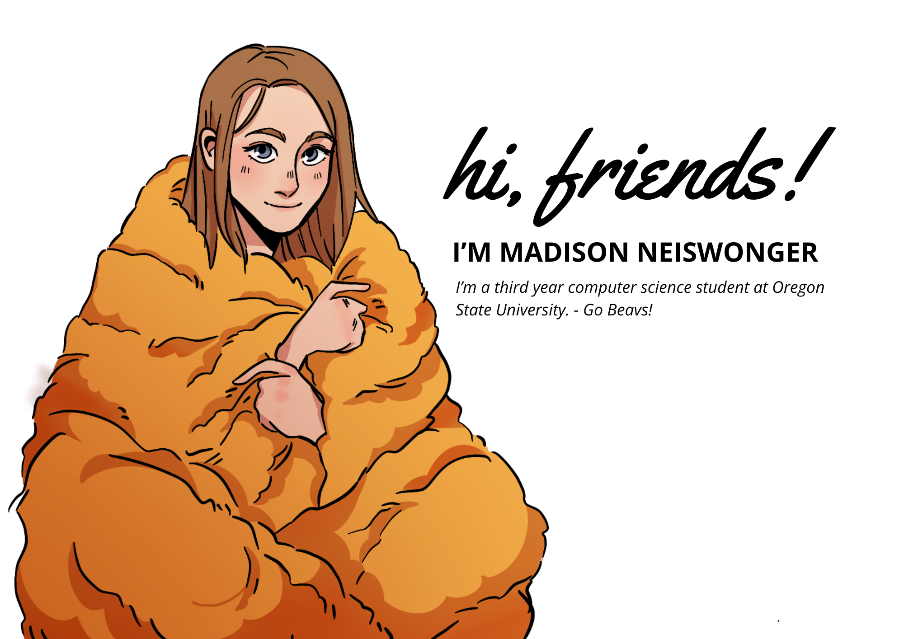

Hello, I'm Madison! I'm a third-year Computer Science student at Oregon State University-Cascades, deeply passionate about harnessing technology to create impactful solutions. My journey in the tech world has been driven by a strong interest in full stack engineering, web development, and software engineering. 

I'm currently on the lookout for internship opportunities to further my experience and contribute to impactful projects. Feel free to reach out, let's connect and explore opportunities in these exciting fields!

ACM-W Student Chapter Officer.

- 📫 You can reach me at NeisMads@gmail.com

<!---
MadsNeis/MadsNeis is a ✨ special ✨ repository because its `README.md` (this file) appears on your GitHub profile.
You can click the Preview link to take a look at your changes.
--->
