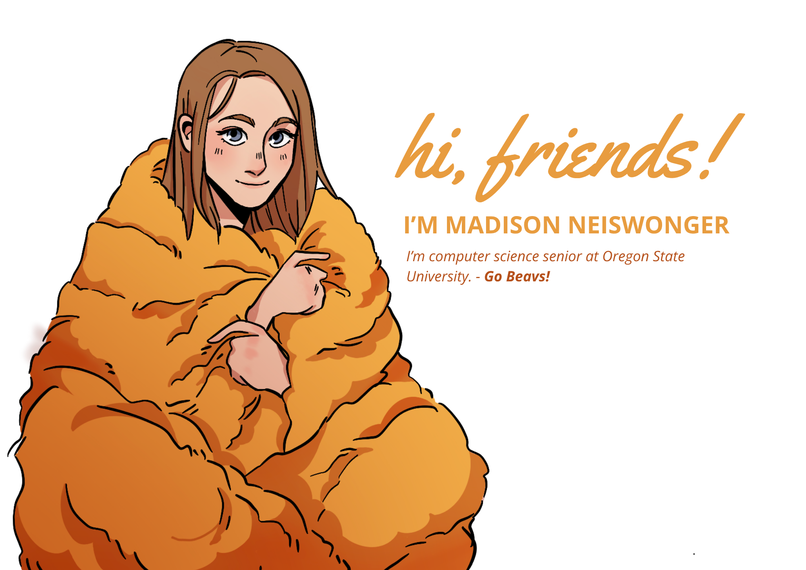

<h1> About Me! </h1>

Hello, I'm Madison! I'm a Computer Science senior at Oregon State University-Cascades, passionate about developing projects that are fun, and that creative a positive impact in someone's world! My journey in the tech world has been driven by a strong interest in full stack engineering, web development, and software engineering. 

<h2> What I'm Looking For </h2>
I'm currently on the lookout for any and all opportunities to refine my skills and develop impactful projects. Feel free to reach out, let's connect!

<h2> Leadership Experience </h2>
Can you guess who's the recently elected President of the Computer Science club for Oregon State Unversity? You're right, it's me! I manage a club of over 50 plus member, organize/lead industry talk presentations, and fundraise money for conferences! 

Official ACM-W Student Chapter Officer.

<h2> Want to Learn More? </h2>

- [✨ Let's connect on LinkedIn!](https://www.linkedin.com/in/madison-neiswonger/)

- [🍡 Check out my personal website!](https://madison-neiswonger.figma.site/)

- 📫 You can reach me at Neismads@gmail.com

<!---
MadsNeis/MadsNeis is a ✨ special ✨ repository because its `README.md` (this file) appears on your GitHub profile.
You can click the Preview link to take a look at your changes.
--->
